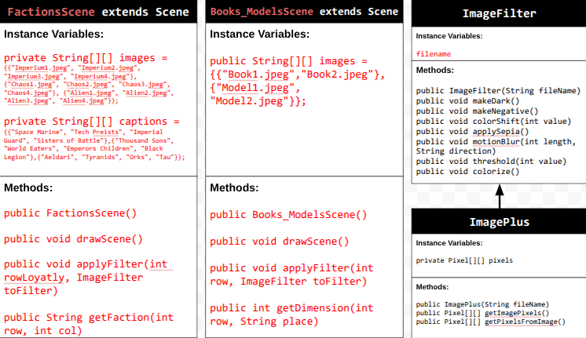
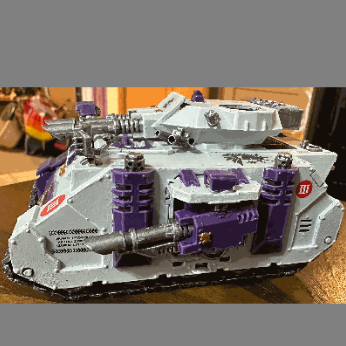

# Unit 5 - Personal Narrative / Interest Animation

## Introduction

Images are often used to portray our personal experiences and interests. We also use image filters and effects to change or enhance the mood of an image. When combined into collages and presentations, these images tell a story about who we are and what is important to us. Your goal is to create an animation using The Theater and Scene API that consists of images of your personal experiences and/or interests. In this animation, you will incorporate data related to these experiences and/or interests that can be organized in a 2D array, and use image filters and effects to change or enhance the mood of your images.
## Requirements

Use your knowledge of object-oriented programming, two-dimensional (2D) arrays, and algorithms to create your personal narrative collage or animation:
- **Write Scene subclasses** – Create two Scene subclasses: either two core parts of your personal life, or two components of a personal interest. Each class must contain a constructor and private instance variable with data related to the scene
- **Create at least two 2D arrays** – Create at least two 2D arrays to store the data that will make up your visualization.
Implement algorithms – Implement one or more algorithms that use loops and logic that operate on the data in your 2D arrays.
- **Create a visualization** – Create an animation that conveys the story of the data by illustrating the patterns or relationships in the data.
- **Image Filters** – Utilize the image filters created in this unit (and possible new filters) that show a personal flare to the images used in your animation.
- **Document your code** – Use comments to explain the purpose of the methods and code segments and note any preconditions and postconditions.

## UML Diagram

## Video

Record a short video of your story to display here on your README. You can do this by:

- Screen record your project running on Code.org.
- Upload that recording to YouTube.
- Take a thumbnail for your image.
- Upload the thumbnail image to your repo.
- Use the following markdown

## Story Description

My animation covers a science fiction fantasy uniniverse, called Warhammer 40,000. The display is divided into two main sections, which are animated by thier respective classes. The first section, FactionScene begins by displaying the title screen. It then proceeds to display several of the different warhammer factions, while stating thier loyatly. For each loyatly, Imperim, Chaos, and Alien, there are four factions listed. After each image is displayed, a filter is applied corresponding to its loyatly, for example Imperium factions are filtered with makeDark(). After these images, the animation moves onto the next class: Books_ModelsScene. This class displays two books and two models in sequence that I personally have of warhammer. When they are dispalyed, a filter is applied depending on whether the image is a book or a model. Then the program concludes with an exit slide.

The data that is represented in the 2D arrays is the image links and for the first class the captions. The images arrays are used to draw all of the images, as they are iterated through during the drawScene method. While the captions array is used to store the second part of the faction name, and is used in getFaction to find what text to display.

## Image Filter Analysis

The filter that I created myself is makeDark(). This filter alters the RGB values to make the image appear more grim and dar. The red value is * 0.6, while the green is * 0.4, and lastly the blue is * 0.5. This darkens the colors, and pronouces the red while weaking the green.

Another filter that I used was makeNegative(). This filter reverses each of the RGB values to inverse the image. This is done by setting the color values to 255 - thier original value, so a blue value of 250 would turn to 5.